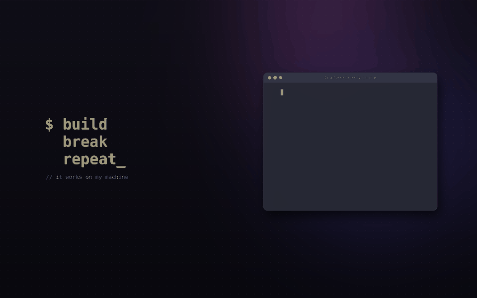
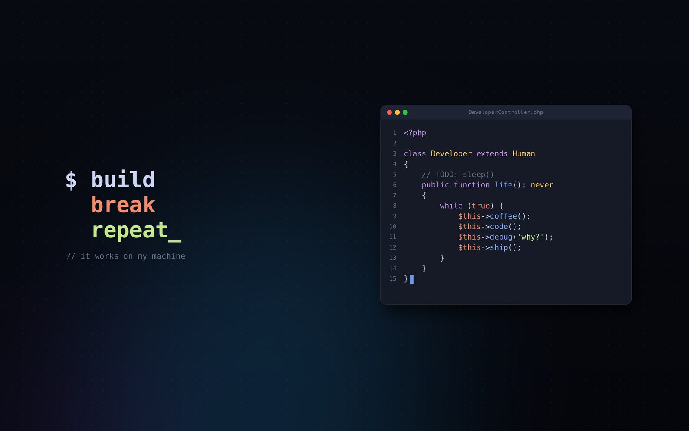
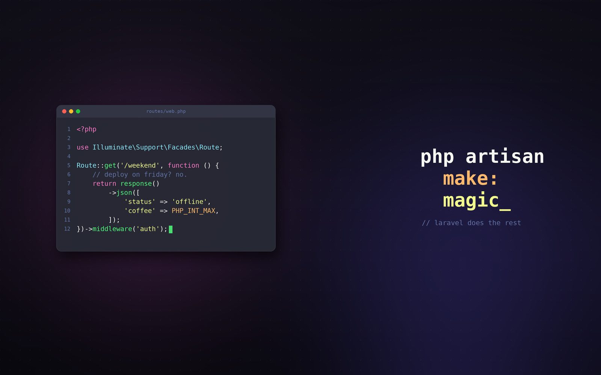
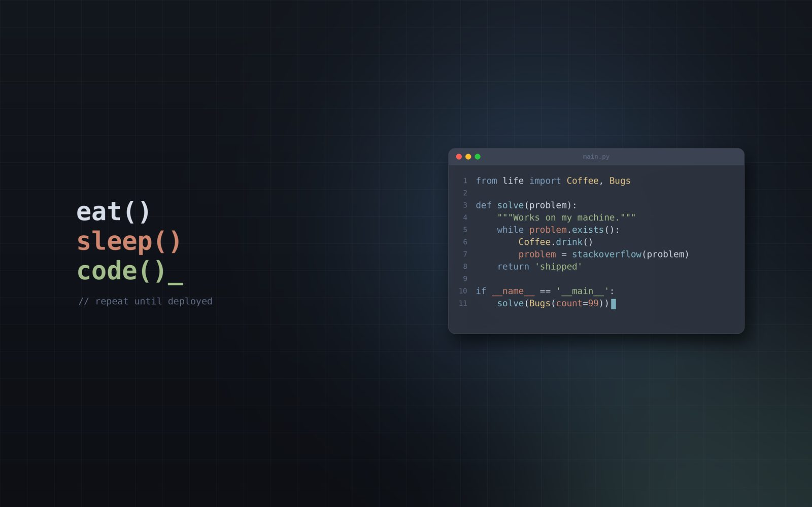
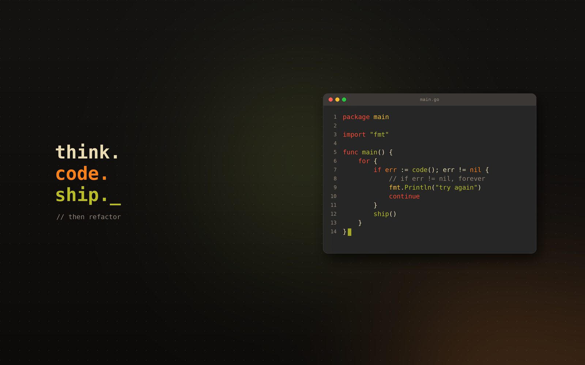
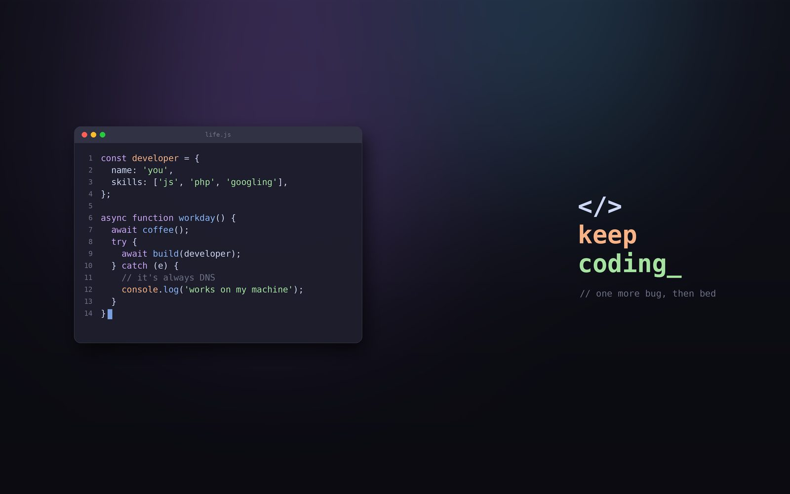
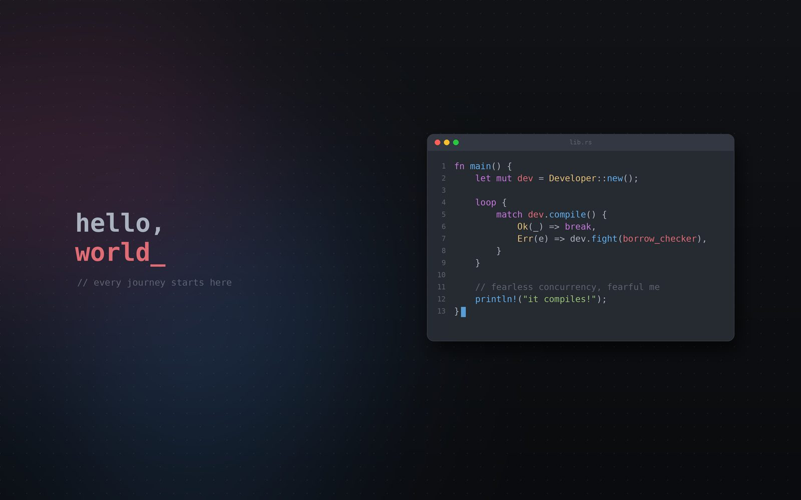

<div align="center">

# 🖥️ dev-wallpaper

**Beautiful, auto-rotating code-editor wallpapers for GNOME — still or animated, and ridiculously lightweight.**



*The animated mode "types" the code line by line, right on your desktop — with no video player running in the background.*


</div>

---

## 📑 Table of contents

- [Features](#-features)
- [Screenshots](#-screenshots)
- [How lightweight is it?](#-how-lightweight-is-it)
- [Requirements](#-requirements)
- [Installation](#-installation)
- [Quick start](#-quick-start)
- [All commands](#-all-commands)
- [Configuration](#-configuration)
- [How it works](#-how-it-works)
- [Uninstall](#-uninstall)
- [Troubleshooting / FAQ](#-troubleshooting--faq)
- [Building from source](#-building-from-source)

---

## ✨ Features

| | Feature | Details |
|---|---|---|
| 🎞️ | **Animated wallpapers** | Code types itself line by line, then the cursor blinks. Uses GNOME's built-in slideshow — no video player, no background process. |
| 🖼️ | **Still wallpapers** | Prefer something calm? Get a single crisp image instead. |
| 🎨 | **6 color themes** | Tokyo Night, Dracula, Nord, Gruvbox, Catppuccin, One Dark. |
| 💻 | **8 languages** | PHP, Laravel, JavaScript, Python, Go, Rust, Bash, SQL — each with a funny developer snippet. |
| 🔄 | **Auto-rotation** | A brand-new random design every *N* minutes (you choose: 5, 15, 30, 60…). |
| 🎲 | **Always different** | Random theme, snippet, tagline, glow position, background pattern (dots / grid / plain) and layout (editor left or right). |
| 📐 | **Fits your screen** | Detects your monitor resolution automatically (from GNOME's `monitors.xml`), or set it manually. Sharp on 1080p, 1440p and 4K. |
| 🧙 | **Easy setup** | Answer a few questions in the terminal, or use the **GUI form** from the app menu (“Developer Wallpaper”). |
| ↩️ | **Safe to turn off** | `--disable` stops rotation and **restores your previous wallpaper**. |
| 👤 | **Per-user, no sudo** | Each user turns it on for themselves; runs as a systemd *user* timer. |
| 🪶 | **Tiny** | 10 KB package, 0 MB RAM between changes. See [the numbers](#-how-lightweight-is-it). |

---

## 📸 Screenshots

All images below were generated by dev-wallpaper itself.

| Tokyo Night · PHP | Dracula · Laravel |
|---|---|
|  |  |

| Nord · Python | Gruvbox · Go |
|---|---|
|  |  |

| Catppuccin · JavaScript | One Dark · Rust |
|---|---|
|  |  |

---

## 🪶 How lightweight is it?

**Short answer: it uses nothing while you work.**

dev-wallpaper is **not** a program that keeps running. A systemd timer wakes it up every *N* minutes, it draws a fresh wallpaper in about a second, hands it to GNOME, and **exits completely**. Between changes there is no process in memory at all.

### Measured numbers

Tested on an AMD Ryzen 5 7535HS, Python 3.12, Pillow 10.2 (one run per mode; times vary a little by machine):

| Screen | Mode | Peak RAM (only while generating) | Time to generate | Disk used |
|---|---|---|---|---|
| 1920×1080 | Still | ~210 MB | ~0.7 s | ~0.1 MB (1 image) |
| 1920×1080 | Animated | ~210 MB | ~2.4 s | ~1.6 MB (17 frames) |
| 2560×1440 | Still | ~210 MB | ~0.8 s | ~0.2 MB |
| 2560×1440 | Animated | ~210 MB | ~3.2 s | ~3.5 MB |
| 3840×2160 (4K) | Still | ~210 MB | ~0.7 s | ~0.3 MB |
| 3840×2160 (4K) | Animated | ~210 MB | ~1–3 s | ~4.2 MB |

### What that means in practice

| Resource | Usage |
|---|---|
| 💾 **RAM while idle** | **0 MB** — nothing runs between wallpaper changes |
| ⚡ **RAM while generating** | ~210 MB for 1–3 seconds, then released |
| 🧠 **CPU** | About 1–3 seconds of one core, once per interval (e.g. once every 30 min) |
| 🎞️ **CPU during animation** | Close to zero — GNOME just swaps pre-made images, no video decoding |
| 📦 **Download size** | ~10 KB `.deb` |
| 📁 **Installed size** | < 100 KB |
| 🗂️ **Wallpaper files on disk** | Max ~9 MB (two folders at 4K animated). Old images are deleted automatically on every change — it **never grows**. |
| 🔋 **Battery** | Negligible — work happens only a few seconds per interval |
| 🌐 **Network** | None. Everything is generated locally, offline. |

> **Why ~210 MB for a moment?** Every design is drawn on a large 3840-pixel canvas and then scaled down to your screen, so text stays razor-sharp on any monitor. That memory is freed as soon as the image is saved.

---

## 📋 Requirements

- **Linux with the GNOME desktop** (Ubuntu, Debian, Fedora-GNOME, Pop!\_OS, …)
- `python3`, `python3-pil` (Pillow)
- `fonts-dejavu` (monospace font)
- `libglib2.0-bin` (`gsettings`), `systemd`, `bash`
- *(optional)* `zenity` for the graphical setup form

On Ubuntu/Debian, `apt` installs all of these for you automatically.

---

## 📥 Installation

### From the `.deb` package (Ubuntu / Debian)

```bash
sudo apt install ./dist/dev-wallpaper_1.0.2_all.deb
```

> Use `apt install ./file.deb` (not `dpkg -i`) so dependencies are installed automatically.

### Build the package yourself

```bash
./build.sh
sudo apt install ./dist/dev-wallpaper_1.0.2_all.deb
```

---

## 🚀 Quick start

After installing, **each user** turns it on once (no `sudo` needed):

### Option 1 — From the app menu (GUI)

Open your apps, search for **“Developer Wallpaper”**, and pick your options in the form:

1. Animated? `yes` / `no`
2. New design every … minutes
3. Seconds per typed line (animation speed)
4. Tick the color themes you like
5. Tick the code languages you like

### Option 2 — From the terminal (interactive)

```bash
dev-wallpaper-setup
```

```text
Animated wallpaper (code types itself)? [yes/no] (yes): yes
Change to a new design every how many minutes? (30): 15
Seconds per typed line, 1 = fastest (1): 1
Themes: tokyo-night dracula nord gruvbox catppuccin one-dark
Which themes? 'all' or comma list (all): dracula,nord
Languages: php laravel javascript python go rust bash sql
Which code languages? 'all' or comma list (all): php,laravel
Developer wallpaper is on: animated=yes, new design every 15 min.
```

### Option 3 — One command

```bash
# Still wallpaper, new one every hour
dev-wallpaper-setup --animated no --interval 60

# Animated, every 15 minutes, only Dracula & Nord, only PHP & Laravel
dev-wallpaper-setup --animated yes --interval 15 --speed 2 --themes dracula,nord --languages php,laravel
```

Your wallpaper changes right away. 🎉

---

## 🧰 All commands

### `dev-wallpaper-setup`

| Command | What it does |
|---|---|
| `dev-wallpaper-setup` | Ask questions (terminal) or show the GUI form (from the app menu) |
| `--animated yes\|no` | Animated typing wallpaper, or a still image |
| `--interval N` | Minutes between new designs (whole number, ≥ 1) |
| `--speed N` | Seconds per typed line in animated mode (1 = fastest) |
| `--themes LIST` | `all` or comma list, e.g. `dracula,nord` |
| `--languages LIST` | `all` or comma list, e.g. `php,laravel,python` |
| `--resolution WxH` | `auto` (default) or e.g. `2560x1440` |
| `--apply` | Re-apply after editing the config file by hand |
| `--now` | Make a new wallpaper right now |
| `--status` | Show current settings and when the next change happens |
| `--disable` | Stop rotating and restore your previous wallpaper |
| `--help` | Show help |

### `dev-wallpaper`

| Command | What it does |
|---|---|
| `dev-wallpaper` | Generate and set one new wallpaper (this is what the timer runs) |
| `dev-wallpaper --list` | List available themes and languages |
| `dev-wallpaper --version` | Show version |

---

## ⚙️ Configuration

Settings are saved in **`~/.config/dev-wallpaper/config`**:

```ini
# dev-wallpaper settings (edit, then run: dev-wallpaper-setup --apply)
ANIMATED=yes
INTERVAL=30
TYPING_SPEED=1
THEMES=all
LANGUAGES=all
RESOLUTION=auto
```

| Key | Values | Default | Meaning |
|---|---|---|---|
| `ANIMATED` | `yes` / `no` | `yes` | Typing animation or still image |
| `INTERVAL` | minutes | `30` | How often a new design is made |
| `TYPING_SPEED` | seconds ≥ 1 | `1` | Delay per typed line |
| `THEMES` | `all` or list | `all` | `tokyo-night, dracula, nord, gruvbox, catppuccin, one-dark` |
| `LANGUAGES` | `all` or list | `all` | `php, laravel, javascript, python, go, rust, bash, sql` |
| `RESOLUTION` | `auto` or `WxH` | `auto` | Output image size |

After editing by hand, run `dev-wallpaper-setup --apply`.

### Where files live

| Path | Contents |
|---|---|
| `~/.config/dev-wallpaper/config` | Your settings |
| `~/.config/dev-wallpaper/original-wallpaper` | Your old wallpaper (restored by `--disable`) |
| `~/.config/systemd/user/dev-wallpaper.timer.d/interval.conf` | Your chosen interval |
| `~/.local/share/dev-wallpaper/set-a/`, `set-b/` | Generated images (auto-cleaned) |

---

## 🔧 How it works

```text
 systemd user timer ──every N min──▶ dev-wallpaper (Python + Pillow)
                                        │
                                        ├─ pick random theme, snippet, tagline, layout
                                        ├─ draw on a 3840px canvas, scale to your screen
                                        ├─ still:    save 1 JPEG
                                        ├─ animated: save ~17 JPEG frames + GNOME slideshow XML
                                        └─ gsettings set org.gnome.desktop.background …
                                        ✔ exit (0 MB RAM until next time)

 GNOME Shell ──▶ shows the image, or steps through the slideshow frames (typing effect)
```

- **Animation without video:** the typing effect is a standard GNOME background slideshow (XML list of images + durations). GNOME updates slideshow backgrounds at most once per second, so animation steps are whole seconds.
- **Two output folders** (`set-a` / `set-b`) are used alternately so GNOME always notices the new wallpaper, and the old folder is emptied each time.
- **Dark & light mode:** both `picture-uri` and `picture-uri-dark` are set.

---

## 🗑️ Uninstall

```bash
# 1. As your normal user: stop rotation and get your old wallpaper back
dev-wallpaper-setup --disable

# 2. Remove the package
sudo apt remove dev-wallpaper

# 3. (optional) Delete your settings and generated images
rm -rf ~/.config/dev-wallpaper ~/.local/share/dev-wallpaper ~/.config/systemd/user/dev-wallpaper.timer.d
```

---

## ❓ Troubleshooting / FAQ

<details>
<summary><b>The wallpaper doesn't change.</b></summary>

Check the timer:

```bash
dev-wallpaper-setup --status
systemctl --user status dev-wallpaper.timer
journalctl --user -u dev-wallpaper.service -n 20
```

Force a change now with `dev-wallpaper-setup --now`.
</details>

<details>
<summary><b>Does it work on KDE, XFCE, Cinnamon…?</b></summary>

No — it sets the wallpaper through GNOME's `gsettings` keys and uses GNOME's slideshow format for animation. It's built for GNOME.
</details>

<details>
<summary><b>Can the animation be faster than 1 second per line?</b></summary>

No. GNOME Shell only updates a slideshow background once per second, so 1 second is the minimum step.
</details>

<details>
<summary><b>The image looks blurry or the wrong size.</b></summary>

Set your resolution explicitly:

```bash
dev-wallpaper-setup --resolution 2560x1440 --apply
```
</details>

<details>
<summary><b>Will it slow down my computer or games?</b></summary>

No. It only runs for 1–3 seconds per interval and then exits. Between changes it uses 0 MB RAM and 0% CPU.
</details>

<details>
<summary><b>I had an older hand-installed version in <code>~/.local/bin</code>.</b></summary>

`dev-wallpaper-setup` detects old units in `~/.config/systemd/user` and migrates automatically; the old script is renamed to `dev-wallpaper.old`.
</details>

---

## 🏗️ Building from source

```text
dev-wallpaper/
├── build.sh                         # builds dist/dev-wallpaper_<version>_all.deb
├── src/
│   ├── DEBIAN/                      # control, postinst, prerm
│   └── usr/
│       ├── bin/dev-wallpaper        # generator (Python + Pillow)
│       ├── bin/dev-wallpaper-setup  # setup / control script (bash)
│       ├── lib/systemd/user/        # dev-wallpaper.service + .timer
│       └── share/applications/      # "Developer Wallpaper" menu entry
└── dist/                            # built .deb
```

```bash
./build.sh
# → Install with:  sudo apt install ./dist/dev-wallpaper_1.0.2_all.deb
```

The version comes from `src/DEBIAN/control`.

---

<div align="center">

Made with ☕ by **Bhavin Vaghadiya** · <vaghadiyabhavin61@gmail.com>

*“It works on my machine.”* 🙂

</div>
